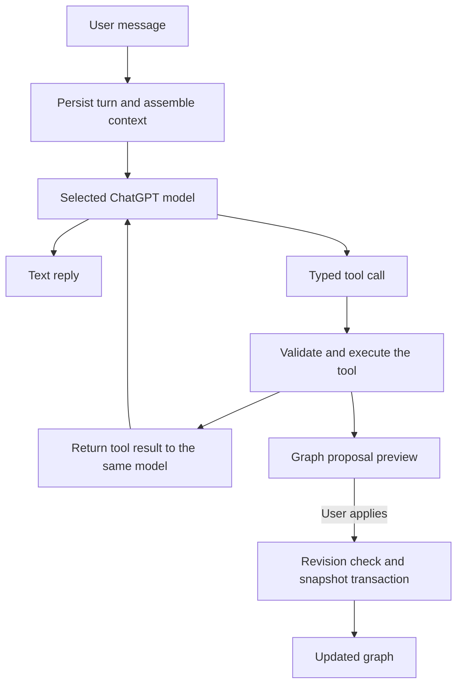

# Agent loop

Clew runs one Responses API loop with the selected ChatGPT model. Each request
receives the stored transcript, fresh workspace context and typed tools. The
model chooses whether to answer, read a topic, ask a question, present a quiz or
propose graph changes. There is no separate action classifier or proposal planner.

Graph proposals are validated before review. Apply checks the graph revision and
commits the change, snapshot and receipt together. Stale or invalid proposals
fail explicitly. The model cannot award completion or silently rewrite the graph.

Questions and quizzes remain persistent cards. The runtime awaits the learner's
answer, returns the result to the model and continues the same turn. Quiz grading
and prerequisite closure are deterministic.

Chat events are persisted and replayed after a renderer reconnect. Stop cancels
the active request. Backend restart interrupts unfinished turns while preserving
completed messages and consistent transcript state. A bounded step limit fails
explicitly; there is no alternate model or transport.

| Owner | Responsibility |
| --- | --- |
| `backend/app/agent/runtime.py` | Turn lifecycle, Responses loop and interaction cards |
| `backend/app/agent/context.py` | Scoped workspace context |
| `backend/app/agent/contracts.py`, `tools.py` | Typed tools and handlers |
| `backend/app/agent/store.py` | Transcripts, events and tool receipts |
| `backend/app/services/proposal_validator.py` | Graph contract validation |
| `backend/app/services/repository.py` | Apply, snapshots and concurrency |
| `backend/app/services/quiz_service.py` | Grading and closure |

See [Architecture](ARCHITECTURE.md) for the full persistence and authentication
contract and [ADR 0006](adr/0006-sign-in-with-chatgpt-agent-runtime.md) for the
selected runtime boundary.
