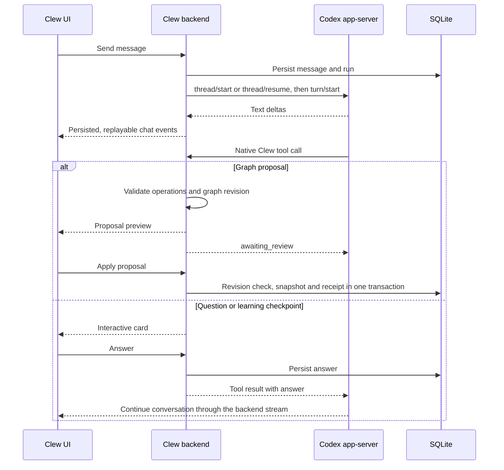

# Architecture

Clew is a local, graph-first learning workspace. Codex owns the agent loop; Clew owns the graph, review UI, study tools, grading and snapshots. [ADR 0005](adr/0005-codex-native-agent-runtime.md) records this boundary.

## Product guarantees

- The graph is the center of truth; a topic is the study unit.
- The model submits proposals. Only the user's Apply action changes the graph.
- Accepted changes and manual study actions create reversible workspace snapshots.
- Formal completion follows deterministic quiz/prerequisite rules.
- The local edition and hosted product remain separate surfaces.

## Agent flow

A normal answer is Markdown text. There is no `answer` tool or JSON action classifier. There is no secondary planner or provider invocation behind a tool. The selected Codex model decides when to use the tools and authors their arguments.

## Native tools

Tools are supplied through experimental `thread/start.dynamicTools`, in the `clew` namespace. Calls arrive through `item/tool/call`; results contain native `inputText` content items. Resumed threads retain the tools registered at creation.

| Tool | Responsibility |
| --- | --- |
| `read_graph` | Fresh graph ids, revision, topology, zones and progress |
| `read_topic` | Full topic, resources, artifacts and prerequisite status |
| `propose_ingest` | Validate a proposal based on supplied material and show review |
| `propose_expand` | Validate a proposed learning-path expansion and show review |
| `ask_question` | Await a choice or free-text reply in a persistent card |
| `present_quiz` | Await one four-choice checkpoint; return server-graded correctness |
| `create_closure_quiz` | Validate and register a full completion test; never award progress directly |

Proposal tools accept explicit topic, edge and zone operations. They reject unknown references, disconnected islands, unsafe resource URLs, malformed operations and new topics claiming earned progress. They do not fabricate missing zones or silently repair semantics. The error goes back to Codex, which may correct its call.

The existing completion-test button starts a separate ephemeral Codex turn with only the read and closure-quiz tools. The model supplies exactly the requested questions; Clew retains correct answers and grades submissions. The existing manual Finish action keeps its explicit prerequisite-closure behavior.

## Process, authentication and permissions

`CodexTransport` starts one owned `codex app-server --listen stdio://` child process. The tested native protocol is the installed Codex Desktop 0.153.4 build. Dynamic tools are experimental: an incompatible CLI produces an explicit connection or protocol error, with no alternate runtime.

Clew uses a dedicated `CODEX_HOME` at `backend/data/codex` and a dedicated working directory at `backend/data/agent-workspace`. Both are ignored by Git. A project-root marker and zero project-instruction budget isolate the agent from repository coding instructions. Shell execution, files/images, browser/computer control, plugins, hooks, Codex memory generation, delegation and host skill discovery are disabled. The sandbox is read-only and approvals are `never`. The optional Web switch controls Codex's native web search.

ChatGPT sign-in uses `account/login/start`, native OAuth completion notifications, `account/read`, cancellation and logout. Device-code sign-in is available as an explicit alternative. Codex owns token refresh and credential storage. Clew does not extract global Codex credentials, ask for provider API keys or proxy ChatGPT HTTP endpoints. Available models and reasoning options come from `model/list`; an unavailable explicit selection fails without substitution.

The local workspace identity at `/api/v1/auth/session` remains separate from Codex account authentication. Graph editing, import/export and existing data remain usable while Codex is disconnected.

The existing read-only MCP server is unchanged. Clew's internal tools do not call it. An agent Codex home containing MCP server configuration is rejected instead of starting those servers. A launcher is outside this change.

## Persistence and reconnect

SQLite stores graph snapshots, chat sessions/messages, quiz sessions and these agent tables:

- `agent_sessions`: Clew session to native thread binding, run, turn, status and client message id.
- `agent_events`: ordered NDJSON events with cursor ids for stream replay.
- `agent_tool_results`: tool call receipts keyed by call id and exact arguments.
- `proposal_applications`: accepted proposal identity, payload and snapshot receipt.

The frontend merges text updates by message id, reconnects from the saved cursor, and keeps inputs separated by graph/session. Disconnecting the browser does not cancel Codex. Stop explicitly interrupts the native turn and releases pending interactions. After a backend restart, incomplete turns/cards are marked interrupted; the native thread id and all completed messages remain. Continuing resumes that thread, with no silent replacement conversation.

Native items keep their individual ids and a persisted `reply_id` identifying the Clew turn. The UI presents one assistant reply with its text above nested proposal, question and quiz cards. It reveals text when the native message completes; streaming still drives progress, tool cards and reconnects. Typed `commentary` updates one preamble until an answer arrives, and completed reads do not become chat rows. An unknown message phase remains ordinary text, with no keyword-based classification. Reasoning items are not projected into the chat. Progress follows the explicit run id, so a new hidden button request cannot reopen an old reply's loader. Session counters count grouped replies and visible user messages.

Each turn receives fresh, scoped graph context and confirmed proposal receipts. Existing pre-Codex messages are imported once into a new native thread as labeled historical data. Memory settings govern that initial import and fresh context blocks; Codex owns ongoing conversation history and compaction.

## Review and concurrency

Apply requires a proposal id and the graph revision used to prepare it. A stale or historical unversioned proposal returns HTTP 409. Repeating an already accepted identical proposal returns the current workspace without creating another snapshot. Reusing its id for different operations fails.

Graph writes, snapshot creation and the chat's applied marker share one SQLite transaction. Other workspace writes compare their parent snapshot before committing, so a concurrent full-workspace update cannot erase an accepted proposal. Graph revisions remain monotonic across rollback and graph recreation. Rollback restores the whole workspace; it does not rewrite conversation history or erase historical apply receipts.

## Owners

| Area | Owner |
| --- | --- |
| Native process, JSON-RPC multiplexing, failures | `backend/app/agent/transport.py` |
| Auth, models, sessions, turn lifecycle | `backend/app/agent/runtime.py` |
| Durable bindings, events and tool receipts | `backend/app/agent/store.py` |
| Tool schemas, context and handlers | `backend/app/agent/contracts.py`, `context.py`, `tools.py` |
| Proposal validation/normalization/preview | `backend/app/services/proposal_service.py`, `proposal_validator.py`, `proposal_normalizer.py` |
| Graph state, snapshots and apply transaction | `backend/app/services/repository.py` |
| Quiz validation and grading | `backend/app/services/quiz_service.py` |
| Chat stream and interactive HTTP endpoints | `backend/app/api/chat_routes.py` |
| Codex account endpoints | `backend/app/api/codex_routes.py` |
| Connection UI and dynamic model settings | `useCodexAccount.ts`, `CodexAccountPanel.tsx` |
| Chat lifecycle and event reconciliation | `useGraphChatController.ts`, `agentEvents.ts` |
| Markdown, proposal and interaction cards | `frontend/src/components/assistant/` |

## Verification

Run backend tests, frontend type checking, tests, localization and production build. The executable under `backend/tests/fixtures/` is a deterministic test peer for the real subprocess/JSON-RPC path; application code never selects it. Those tests verify integration behavior without consuming a user's model quota. A native handshake/schema check verifies the installed CLI separately. Successful authenticated inference requires the owner to complete ChatGPT sign-in.
