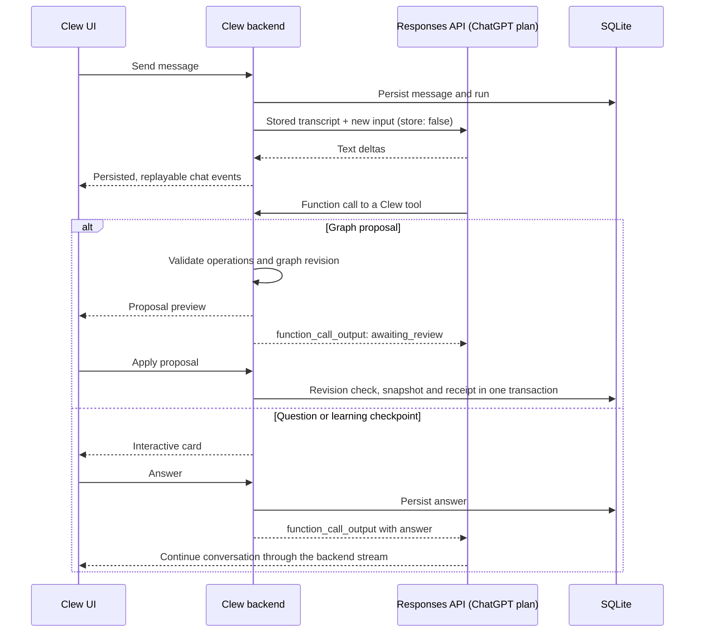

# Architecture

Clew is a local, graph-first learning workspace. A small Clew-owned agent loop runs on the Responses API with the learner's ChatGPT plan (Sign in with ChatGPT); Clew owns the graph, review UI, study tools, grading and snapshots. [ADR 0006](adr/0006-sign-in-with-chatgpt-agent-runtime.md) records this boundary.

## Product guarantees

- The graph is the center of truth; a topic is the study unit.
- The model submits proposals. Only the user's Apply action changes the graph.
- Accepted changes and manual study actions create reversible workspace snapshots.
- Formal completion follows deterministic quiz/prerequisite rules.
- The local edition and hosted product remain separate surfaces.

## Agent flow

```mermaid
sequenceDiagram
    participant UI as Clew UI
    participant API as Clew backend
    participant C as Responses API (ChatGPT plan)
    participant DB as SQLite
    UI->>API: Send message
    API->>DB: Persist message and run
    API->>C: Stored transcript + new input (store: false)
    C-->>API: Text deltas
    API-->>UI: Persisted, replayable chat events
    C->>API: Function call to a Clew tool
    alt Graph proposal
        API->>API: Validate operations and graph revision
        API-->>UI: Proposal preview
        API-->>C: function_call_output: awaiting_review
        UI->>API: Apply proposal
        API->>DB: Revision check, snapshot and receipt in one transaction
    else Question or learning checkpoint
        API-->>UI: Interactive card
        UI->>API: Answer
        API->>DB: Persist answer
        API-->>C: function_call_output with answer
        C-->>UI: Continue conversation through the backend stream
    end
```

A normal answer is Markdown text. There is no `answer` tool or JSON action classifier. There is no secondary planner or provider invocation behind a tool. The selected model decides when to use the tools and authors their arguments.

## Native tools

Tools are supplied as Responses API function tools on every request (`parallel_tool_calls: false`). Each `function_call` is executed by Clew and answered with a `function_call_output` holding JSON. Results are idempotent per call id. One learner turn is bounded to a fixed number of model steps and fails explicitly beyond it.

| Tool | Responsibility |
| --- | --- |
| `read_graph` | Fresh graph ids, revision, topology, zones and progress |
| `read_topic` | Full topic, resources, artifacts and prerequisite status |
| `propose_ingest` | Validate a proposal based on supplied material and show review |
| `propose_expand` | Validate a proposed learning-path expansion and show review |
| `ask_question` | Await a choice or free-text reply in a persistent card |
| `present_quiz` | Await one four-choice checkpoint; return server-graded correctness |
| `create_closure_quiz` | Validate and register a full completion test; never award progress directly |

Proposal tools accept explicit topic, edge and zone operations. They reject unknown references, disconnected islands, unsafe resource URLs, malformed operations and new topics claiming earned progress. They do not fabricate missing zones or silently repair semantics. The error goes back to the model, which may correct its call.

The existing completion-test button starts a separate ephemeral turn with only the read and closure-quiz tools. The model supplies exactly the requested questions; Clew retains correct answers and grades submissions. The existing manual Finish action keeps its explicit prerequisite-closure behavior.

## Authentication and plan usage

Sign in with ChatGPT is OAuth 2.0 with PKCE, an OIDC nonce and dynamic client registration. `POST /api/v1/chatgpt/login` returns the authorization URL; the issuer redirects to `http://127.0.0.1:<backend port>/auth/callback`, which checks the loopback host and state, keeps the issued client id, exchanges the code, verifies the RS256 ID token against the issuer's JWKS and stores the credentials. Requested scopes include `offline_access` and `chatgpt.tokens.use.direct`; without the sharing scope the UI shows the connection as unusable rather than falling back.

Access and refresh tokens live only in the OS credential store through `keyring` (macOS Keychain, Windows Credential Locker, Secret Service). If none is available, sign-in fails; there is no plaintext fallback. `backend/data/chatgpt-registration.json` keeps only the issued client id and account label. Tokens refresh one minute before expiry under a lock; a refreshed ID token must keep the same subject. Sign-out deletes local tokens first, then revokes the refresh token and reports when revocation is unconfirmed.

Requests go to `https://api.openai.com/v1/responses` with the bearer token and `store: false`, and consume the learner's ChatGPT Plus or Pro allowance. Models come from `GET /v1/models` (entries with `visibility: list`); the first listed model is the plan default and an unavailable explicit selection fails without substitution. Plan errors (`subscription_sharing_*`), including the per-app weekly limit set in ChatGPT Settings → Usage, are shown as explicit failures. The optional Web switch adds the hosted `web_search` tool.

The local workspace identity at `/api/v1/auth/session` remains separate from the ChatGPT connection. Graph editing, import/export and existing data remain usable while signed out.

The existing read-only MCP server is unchanged. Clew's internal tools do not call it.

## Persistence and reconnect

SQLite stores graph snapshots, chat sessions/messages, quiz sessions and these agent tables:

- `agent_sessions`: Clew session run, status and client message id.
- `agent_transcripts`: the Responses input items of each conversation, re-sent every step.
- `agent_events`: ordered NDJSON events with cursor ids for stream replay.
- `agent_tool_results`: tool call receipts keyed by call id, conversation and exact arguments.
- `proposal_applications`: accepted proposal identity, payload and snapshot receipt.

The frontend merges text updates by message id, reconnects from the saved cursor, and keeps inputs separated by graph/session. Disconnecting the browser does not cancel the turn. Stop cancels the in-flight request and releases pending interactions. The transcript is saved only at consistent points (after a step's tool outputs, or at completion), so an interrupted or failed turn never leaves a function call without its output. After a backend restart, incomplete turns/cards are marked interrupted; the transcript and all completed messages remain.

Output items keep their individual ids and a persisted `reply_id` identifying the Clew turn. The UI presents one assistant reply with its text above nested proposal, question and quiz cards. It reveals text when the message item completes; streaming still drives progress, tool cards and reconnects. Typed `commentary` updates one preamble until an answer arrives, and completed reads do not become chat rows. An unknown message phase remains ordinary text, with no keyword-based classification. Reasoning items stay encrypted in the transcript and are not projected into the chat. Progress follows the explicit run id, so a new hidden button request cannot reopen an old reply's loader. Session counters count grouped replies and visible user messages.

Each turn receives fresh, scoped graph context and confirmed proposal receipts. A conversation without a stored transcript (older messages, including the Codex era) is imported once as labeled historical data. Memory settings govern that import and the fresh context blocks; after that Clew keeps the transcript.

## Review and concurrency

Apply requires a proposal id and the graph revision used to prepare it. A stale or historical unversioned proposal returns HTTP 409. Repeating an already accepted identical proposal returns the current workspace without creating another snapshot. Reusing its id for different operations fails.

Graph writes, snapshot creation and the chat's applied marker share one SQLite transaction. Other workspace writes compare their parent snapshot before committing, so a concurrent full-workspace update cannot erase an accepted proposal. Graph revisions remain monotonic across rollback and graph recreation. Rollback restores the whole workspace; it does not rewrite conversation history or erase historical apply receipts.

## Owners

| Area | Owner |
| --- | --- |
| Sign in with ChatGPT, token storage and refresh | `backend/app/agent/chatgpt_auth.py` |
| Responses streaming and model catalog | `backend/app/agent/chatgpt_api.py` |
| Agent loop, models, sessions, turn lifecycle | `backend/app/agent/runtime.py` |
| Transcripts, events and tool receipts | `backend/app/agent/store.py` |
| Tool schemas, context and handlers | `backend/app/agent/contracts.py`, `context.py`, `tools.py` |
| Proposal validation/normalization/preview | `backend/app/services/proposal_service.py`, `proposal_validator.py`, `proposal_normalizer.py` |
| Graph state, snapshots and apply transaction | `backend/app/services/repository.py` |
| Quiz validation and grading | `backend/app/services/quiz_service.py` |
| Chat stream and interactive HTTP endpoints | `backend/app/api/chat_routes.py` |
| ChatGPT account endpoints and OAuth callback | `backend/app/api/chatgpt_routes.py` |
| Connection UI and model settings | `useChatGPTAccount.ts`, `ChatGPTAccountPanel.tsx` |
| Chat lifecycle and event reconciliation | `useGraphChatController.ts`, `agentEvents.ts` |
| Markdown, proposal and interaction cards | `frontend/src/components/assistant/` |

## Verification

Run backend tests, frontend type checking, tests, localization and production build. The executable under `backend/tests/fixtures/` is a deterministic test peer for the real subprocess/JSON-RPC path; application code never selects it. Those tests verify integration behavior without consuming a user's model quota. A native handshake/schema check verifies the installed CLI separately. Successful authenticated inference requires the owner to complete ChatGPT sign-in.
